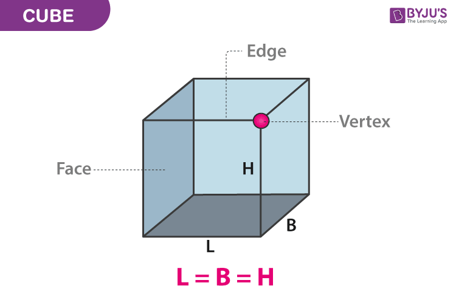

# Intro

<!-- name, why learn programming? -->

# Intro

<!-- translate -->

- Mexicano, DACA
- Santa Fe, NM
- *ciencias de la computación y matemáticas* | computer science and math, New Mexico Tech, 2018
- Triplebyte *empresa de reclutamiento* | recruitment company
- healthcare startups
  - a startup is a company that is just starting and could be getting investment funding
  - *un startup es una empresa que recién está comenzando y que podría obtener financiación para inversiones*
- renewable energy company building software for controlling electric vehicle charging stations
  - *software para controlar cargadores de vehículos eléctricos* 
  - [PowerFlex](https://www.powerflex.com/)

# Visit

- [roguh.com/e](/e)
- [roguh.com/equipo](/equipo)

# What to Expect

<!-- translate -->

- 12 + 1 *programas* | programs
- Python *ejercicios* | exercises on Chromebook

# What is programming?

> La programación es el arte y la ciencia de traducir ideas en un programa

> [Programming is the art and science of translating a set of ideas into a program](https://en.wikiversity.org/wiki/What_is_%22programming%22)

> Un programa es **una lista de instrucciones exactas que puede seguir una computadora**.

> [A program is **a list of [exact] instructions a computer can follow**.](https://en.wikiversity.org/wiki/What_is_%22programming%22)

# What is programming, really?

<iframe style="margin:0 auto" width="100%" height="100%" src="https://www.youtube-nocookie.com/embed/Ct-lOOUqmyY" frameborder="0" allow="accelerometer; autoplay; encrypted-media; gyroscope; picture-in-picture" allowfullscreen></iframe>

youtu.be/Ct-lOOUqmyY

# What is programming, really?

Computers:

- *Rápidas* | Fast
- *Tontas* | Very dumb
- *Flexible* | Very flexible. **Programmable**
- *Toma las cosas literalmente* | Takes instructions very literally, has special powers.
  - What special powers?

# *Que pueden hacer?* What can they do?

- *controlar la tecnología*
- **controlling technology** (a LOT of technology?)
- automating tasks: computers can do the boring things quickly
- analyzing data and discovering new insights
- all forms of science: biology, medicine, physics, rocket science, mathematics
- improve communication, access to knowledge
- *organizando información*
- **organizing information.** uses many fascinating branches of mathematics
- make new forms of art
- improving existing industries (healthcare, electric vehicle charging, ...)
- out-competing existing businesses

# Visit

[repl.it/languages/python3](https://repl.it/languages/python3)

- REPL: Read, Evaluate, Print, Loop
  - *Lee* | Read: you type in code, the computer reads it
  - *Evalúa* | Evaluate: the computer runs the code
    - Computes, thinks, translates, acts, does what you told it to do
  - *Imprime* | Print: the computer prints the results
  - *Repite* | Loop: repeats, this same thing happens all over again

# Program 0

```python
print("¡Hola Mundo!")
```

```python
print("Hello, world!")
```

# Program 1

```python
name = "Alice"
message = "Hello," + name
print(message)
```

```python
nombre = "Alice"
mensaje = "Hola" + nombre
print(mensaje)
```

## *Que va a hacer?*

## What will it do?

`print` *quiere decir imprimir*

# Program 1: output

```python
name = "Alice"
message = "Hello," + name
print(message)
```

```python
nombre = "Alice"
mensaje = "Hola" + nombre
print(mensaje)
```

### Output

```
Hello,Alice
HolaAlice
```

# Program 1.1

```python
name = "Alice"
message = "Hello, " + name
print(message)
```

```python
nombre = "Alice"
mensaje = "Hola " + nombre
print(mensaje)
```

## Output

```
Hello, Alice
Hola Alice
```

# What is a programming language for?

<!-- translate -->

> para expresar un conjunto de instrucciones detalladas para una computadora digital

> for expressing a set of detailed instructions for a digital computer

[Read more here](https://www.britannica.com/technology/computer-programming-language)

# Python


<!-- translate -->

*Fácil de aprender, comúnmente utilizado por científicos y empresas.*

Easy to learn, commonly used by scientist and companies.

# Uses?

<!-- translate -->

- [SciPy](https://scipy.org/), [Numpy](https://numpy.org/), [Pandas](https://pandas.pydata.org/)
  - los científicos y matemáticos los utilizan para procesar todo tipo de datos. 
  - scientists and mathematicians use these to process all kinds of data.
- [Tensorflow](https://www.tensorflow.org/)
  - *Populares **libraries** de aprendizaje automático. Redes neuronales, inteligencia artificial.*
  - Popular machine learning **libraries**. Neural networks, artificial intelligence.
- [Flask](https://flask.palletsprojects.com/) and [Django](https://www.djangoproject.com/)
  - *servidor web* | web servers
- *Mi trabajo: controlar la velocidad (los amperios) a la que se cargan los vehículos eléctricos.*
- My work: controlling how fast (the amps) electric vehicles charge.

In general:

- *Escribir programas rápidamente* | Writing programs quickly. *Practicar* | Practicing.
- *Aprender* | Learning.

# Program 1.2

```python
nombre = "Alice"
print("Hello, " + nombre + "!")
```

# Program 1.2: output

```python
nombre = "Alice"
print("Hello, " + nombre + "!")
```

## Output

```
Hello, Alice!
```

# Program 2: Two variables

```python
nombre = "Zach"
saludo = "Goodbye"
print(saludo + nombre)
```

<!-- translate -->

# Exercise: ABBA

```
first = "a"
second = "b"
print(<YOUR CODE HERE>)
```

*Debería imprimir* | It should print:

```
abba
```

# CodingBat!

codingbat.com -> Python -> String-1 -> `make_abba`

[codingbat.com/prob/p182144](https://codingbat.com/prob/p182144)

To do more coding bat you'll need to learn about list/string slices
and other Python concepts...

# Program 3: Arithmetic and Numbers

```python
print(1 + 2 * 4 - 10 / 2)
print(2 ** 10)
print(195.51 // 10)
```

# Program 3.1: A googol, *notación científica* | scientific notation

```python
print(10 ** 100)
print(1e100)
```

- `5e23 == 5 * 10 ** 23`
- `3.95e-5 == 3.95 * 10 ** (-5)`
- `^` has a different meaning in Python.
  - `142 ^ 51 != 142 ** 51` (*NO SON IGUAL* | NOT EQUAL)

# Program 4: More math and modules/libraries

```python
import math
radius = 145
print(math.pi * radius ** 2)
```

# Program 5: Input

```python
import math
user_input = input("Please enter the radius: ")
radius = float(user_input)
print(math.pi * radius ** 2)
```

## *Nombres para números* | Names for numbers

### float 

*número de coma/punto flotante* | number with a "floating point"

1.1, 1.0, 99.124124, 0.000123, -50.05

### integer, int

*un número entero* | whole number

1, -50, 0, 1000000000000

`int(4.9) == 4`

# Exercise: *calcule el volumen de un cubo* | compute the volume of a cube

```
user_input = <YOUR CODE HERE>
side_length = float(user_input)
print(<YOUR CODE HERE>)
```



# Exercise: *calcule el volumen de un cubo* | compute the volume of a cube

```
user_input = <YOUR CODE HERE>
side_length = float(user_input)
print(<YOUR CODE HERE>)
```

- *¿Cómo obtener información?*
- How to get the side length?
- *¿Cómo calcular el volumen de un cubo?*
- How to compute the volume of a cube?

# *E/S* | I/O

- *Entrada or ingresar de información* | Input. Receive information from the world.
  - Keyboard, touch screen
  - Hard drives, SSDs, RAM, memory
  - Network (other computers)
  - GPS, thermometers, other special hardware
- *Salida de información* | Output. Deliver information to the world.
  - Screens
  - Printers
  - Hard drives, SSDs, RAM, memory
  - Network (other computers)
  - How fast a rocket should go, other special hardware

[*Periférico de entrada*](https://es.wikipedia.org/wiki/Periférico_de_entrada)

[Input/Output](https://en.wikipedia.org/wiki/Input/output)

# Program 6: *Dibuja con una tortuga* | Drawing with Turtle

```python
import turtle

turtle.forward(100)
turtle.color("red")
turtle.left(90)
turtle.forward(50)
```

# How to run

*Por favor crea una cuenta*

You need a free account.

[replit.com/languages/python_turtle](https://replit.com/languages/python_turtle)

# Program 7: *Escalones* | Stairs

```python
turtle.forward(100)
turtle.left(90)
turtle.forward(100)
turtle.right(90)

turtle.forward(100)
turtle.left(90)
turtle.forward(100)
turtle.right(90)

turtle.forward(100)
turtle.left(90)
turtle.forward(100)
turtle.right(90)
```

# Program 8: *Iteración* | For loops (AKA iteration)

```python
import turtle

for color in ['red', 'green', 'orange', 'blue']:
    turtle.color(color)
    turtle.forward(75)
    turtle.left(90)
```

# Program 8.1: *Escalones v2* | Stairs v2

Version 2

```python
import turtle

for stair_count in range(40)
    turtle.forward(10)
    turtle.left(90)
    turtle.forward(10)
    turtle.right(90)
```

# Program 8.2: *Escalones de colores*

```python
import turtle

colors = ["red", "orange", "green", "blue", "purple"]

for stair_count in range(40):
    # Pick a color
    turtle.color(colors[stair_count % len(colors])
    # Draw 1 stair
    turtle.forward(10)
    turtle.left(90)
    turtle.forward(10)
    turtle.right(90)
```

# Exercise: *Dibuja un cuadrado* | Draw a square

```
import turtle

side_length = 100

<YOUR CODE HERE>
```

# Exercise: *Dibuja un cuadrado junto a un triángulo* | Draw a square next to a triangle

```
import turtle

side_length = 100

<YOUR CODE HERE>
```

# Trick: Speedup turtle when drawing complex things

```python
turtle.speed("fastest")
```

```python
turtle.tracer(False) # Esconde | Hide the turtle until it's done
turtle.update() # Enseñar | Show what the turtle drew
```

# Squares

```python
import turtlae

turtle.speed("fastest")
for square_number in range(35):
  turtle.left(10)
  for _ in range(4):
    turtle.forward(200)
    turtle.left(90)
```

triangles? octagons?

# Advanced program: *Recursividad* | Recursion

```python
import turtle

def koch_line(width, depth=0):
    if depth <= 0:
        turtle.forward(width)
    else:
        koch_line(width / 3, depth - 1)
        turtle.left(60)
        koch_line(width / 3, depth - 1)
        turtle.right(2 * 60)
        koch_line(width / 3, depth - 1)
        turtle.left(60)
        koch_line(width / 3, depth - 1)

def koch_snowflake(width=100, depth=1):
    for _ in range(3):
        koch_line(width, depth)
        turtle.right(180 - 60)

turtle.speed('fastest')
koch_snowflake(200, 3)
turtle.done()
```

- functions
- recursive functions
- more for loops
- if-statements
- `number1 <= number2`
- function arguments with default values

<!-- maybe l8r... bilingual and we have to make accounts... and it's 26 students

# Program 9: lists and indexing

```python
```

# Optional program X: list slices

```python
```

# Optional program Y: list length

```python
```

# Optional program Z: dictionaries

```python
```

# Optional program H: boolean and if-statements

```python
```

# Optional program G: string methods

```python
```

--->

# Program 11: HTTP *solicitudes* | requests with `requests` library

```python
import urllib
base_url = 'https://www.google.com/search?q='
query = urllib.parse.quote_plus('equipo academy')
response = requests.get(base_url + query)
print(response.status_code)
print(response.text)
```

`response.status_code` 200 is ok.

`response.status_code` ≥400 is **error**

[Status codes](https://developer.mozilla.org/en-US/docs/Web/HTTP/Status)

# A warning!

<!-- translate -->

*La versión 2 de Python es muy antigua y ya no recibe actualizaciones.*

Python version 2 is very old and no longer maintained.

```python
print "Hello, world!"
```

Find newer resources!

## Maintaining software

Receiving updates. Taking care of security problems.

# A good sign

```
$ python --version
Python 3.9.7
```

```
>>> import sys
>>> sys.version
'3.9.7 (default, Oct 10 2021, 15:13:22) \n[GCC 11.1.0]'
```

# A list of Python features

- type hints
- builtin list, dict, set
- list comprehensions
- dict comprehensions
- `for i, e in enumerate(collection)`
- OOP
- setup.py and source code in src/PACKAGENAME
- pydocstyle and pylint for linting
- black and isort for formatting (PEP 8)
- bandit and safety for security scanning
- builtin json library
- builtin enum library
- builtin unittest library
- builtin re library
- builtin copy library
- builtin random library
- builtin math library
- builtin datetime library
- builtin pprint library
- builtin itertools library (count)
- builtin collections library (defaultdict)
- builtin argparse library
- pytest for running tests and getting nice output
- pydantic for validation with nice error messages and a type-base interface
- cerberus for validation (being phased out)
- config in environment variables https://12factor.net/
- pdb for debugging
- docstrings for documentation
- `__str__` method for string representation
- type hints (need an extra tool to actually typecheck), builtin typing library
- `-1` as a list index
- f-strings for interpolation
- `b"binary data"` for bytes
- `str.join`
- `float('inf')` for infinity
- keyword arguments
- keyword arguments from a dict

# Some computer science and programming topics

- Linux: install it on a laptop
- Types
- Algorithms: Sorting, image processing
- Data structures: lists, trees, searching for words quickly, organize data
- Databases
- HTTP
- HTML and CSS
- Docker, Kubernetes

# Linux

- [Mint](https://linuxmint.com/)
- [Ubuntu](https://ubuntu.com/tutorials/install-ubuntu-desktop#1-overview)
- [Arch Linux](https://archlinux.org/)
- [Linux from scratch](https://www.linuxfromscratch.org/)

# My computer

- Manjaro Linux (based off Arch Linux)
- i3 window manager
- neovim with [lots of plugins](https://github.com/roguh/confs/tree/main/vim)
- ASDF for installing Python, can also use PyEnv or Anaconda
- Firefox
- Slack, Teams, Outlook for work

# Android

- a type of Linux!
- Try installing [F-Droid](https://www.f-droid.org/) to install [Termux](https://termux.com/) to try out Linux
- You can also install Termux on some Chromebooks
- You can run Python on Termux
- To make Android apps, you need to use Java or Kotlin and the [Android Studio](https://developer.android.com/studio)
  - [How to build an app](https://developer.android.com/training/basics/firstapp)

# Videogames in Python

Use pygame at [replit.com/new/pygame](https://replit.com/new/pygame)

[askpython.com/python/examples/easy-games-in-python](https://www.askpython.com/python/examples/easy-games-in-python)

[realpython.com/pygame-a-primer/](https://realpython.com/pygame-a-primer/)

Free and powerful: [Unity](https://unity.com/) and [Godot](https://godotengine.org/).

# Recommended resources:

<!-- translate more -->

*Todos usan estos recursos, incluso los profesionales:*

Everyone uses these, even professionals:

- Google
- Stackoverflow
- Python documentation [docs.python.org/3.9/](https://docs.python.org/3.9/)
  - Pick the Python version you have!

*Gratis:*

Free:

- Python Tutor to get a deep understanding of the code [pythontutor.com/](https://pythontutor.com)
- A sturdy textbook
- [YouTube](https://www.youtube.com/results?search_query=python+for+beginners)
- [Introduction to Python Programming at Udacity](https://classroom.udacity.com/courses/ud1110)
- Many more

*Necesitan dinero:*

Money:

- $29.99 [Learn Python 3 The Hard Way](https://shop.learncodethehardway.org/access/buy/9/)

# Learning resources

<!-- translate more -->

*Todo lo que necesitas es una computadora y tiempo.*

All you need is a computer and time.

- self-teaching is common and feasible thanks to open-source
- the "real world" tools are freely available!
- the state of the art tools are sometimes freely available too!
- so are often-official tutorials and documentation

# Links

- [**http://learnpythonthehardway.org/**](http://learnpythonthehardway.org/)
- [practicepython.org/](https://www.practicepython.org/)
- Corey Schafer [youtube.com/user/schafer5/playlists](https://www.youtube.com/user/schafer5/playlists)
- [automatetheboringstuff.com](https://automatetheboringstuff.com/)
- MIT course on edX: [edx.org/course/introduction-to-computer-science-and-programming-7](https://edx.org/course/introduction-to-computer-science-and-programming-7)
- [wikiversity](https://en.wikiversity.org/wiki/Category:Introduction_to_Computer_Science)
- [pyladies.com/resources/](https://www.pyladies.com/resources/)
- [Mark Galassi's serious programming course](https://markgalassi.sourceforge.io/small-courses-html/index.html)

# *También puedes comenzar con JavaScript* | You can also start with JavaScript

*Se utiliza para crear sitios web y servidores web.*

It is used to make websites and web servers.

# Installing JavaScript

- *Ya lo tienes*
- You already have it!
  - Press Ctrl+Shift+C on your web browser
- More advanced: install TypeScript, npm or yarn, node


# Program 12: JavaScript

<!-- translate -->

```javascript
let user_input = prompt("Enter the size of a square")
let number = Number(user_input)
let area = number * number
console.log("The area is " + area)
```

# Projects

*Encuentra un proyecto que te apasione.*

Find a project you're passionate about.

- a cooking tool
- a video game
- an AI
- a website, add JavaScript
- an app
- a scientific experiment
- faster, lots of users, different scenarios
- scrape a website: youtube downloader, instagram downloader, wikipedia

[reddit.com/r/dailyprogrammer/](https://www.reddit.com/r/dailyprogrammer/)

# Aprende a aprender

*Ser un autodidacta te ayudara*

Learn to teach yourself

This will help you in college and in any other opportunities you may take.

As a professional, I have to learn new technologies every few years.

# How to learn more

- a group
- a group online
- university degree
- bootcamps
- internships
- work experience

[hugo@roguh.com](mailto:hugo@roguh.com)

[roguh.com/contact](https://roguh.com/contact)

# Other programming languages

<!-- translate -->
- TypeScript: JavaScript with more reliability
  - Web servers, websites
- Python with type hints: like TypeScript
- Rust: Very advanced, very fast, very reliable
  - Hardware control, web servers
- Go: Not as advanced, very fast, very reliable
  - Web servers
- C++, C: Very advanced, very fast, not so reliable. Can make Python code faster.
  - Videogames, multimedia, hardware control, operating systems, Python itself
- Java
  - Android apps (Also see Kotlin)
- Haskell, OCaml: Functional programming. OCaml is faster, Haskell has more interesting features.


# Advice

<!-- translate -->

[How I would learn to code (if I could start over)](https://www.youtube.com/watch?v=MHPGeQD8TvI)

- explore outside of school and assignments! explore a lot!

- go through basics quickly, a few hours a day.
  - don't get stuck on the details or take a ton of notes on syntax
  - just focus on understanding and trying things out

- when you're ready, do some of your own projects
  - passion projects: interesting/useful
  - start small
  - don't be afraid to do something has already done!

- just don't copy code without understanding. you won't learn!

- try a bunch of things with your code!
  - reveal new things you can learn

- learn how to get unstuck
  - EVERYONE gets stuck
  - everyone uses stackoverflow.com
- read read read read read read read read read read read read read read read read read read read read 

- be ok with not knowing things
  - stay calm
- even for good programmers, writing code without errors is rare

- find a community or get a job/internship!!! try very hard to do this

- everyone always must learn!
  - always update, always new details to learn, always can go deeper

