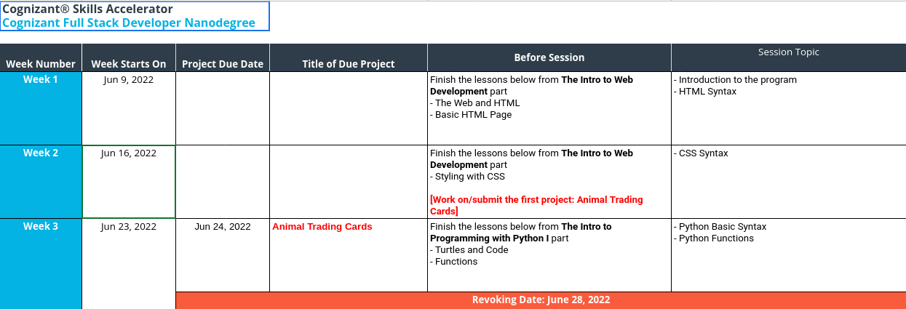

<!-- short break at 4PM EST and check-ins by 4:15PM EST -->

# About me

Hugo (pronounced [oo-GOH](https://www.youtube.com/watch?v=eG6yQMp9EdE))

- I love learning and I love teaching
- Raised in Santa Fe, New Mexico
- Bachelor's in Computer Science (CS) at NMT in New Mexico
- Working at renewable energy technology company making electric vehicle chargers smarter
  - Python to interact with many types of hardware and the cloud
  - JavaScript to build HTTP APIs and web UIs
  - Rust to interact with some hardware, faster and more reliable than Python
  - distributed systems
  - Docker and Kubernetes
  - All our code is on GitHub, we collaborate on there
- [powerflex.com](https://powerflex.com)


# Ice breaker

- introduce yourself: your name and where are you?
- where in the world would you like to go or where suits your personality?

# This presentation's agenda

See the table of contents with the button on the bottom right

## Link to these slides

These slides are an HTML document available on my personal website.

[roguh.com/udacity2022](https://roguh.com/udacity2022)

# How's the course going?

You may use the Zoom "raise your hand" feature

- What were the blockers you faced?
- What was especially challenging?
- What did you learn?

# Attendance

**Please send me a message on Zoom with your full name so I can mark you present.**

Attendance is mandatory, unless you are excused by your session lead.

You may request to reschedule your connect session if another time could work better for you.

## Missing a session

I can excuse you if you reach out ahead of time with a good reason.

# The Course Schedule

[https://docs.google.com/spreadsheets/d/1xJ2C_XZqgvTmsGzLml67zGtIBFrnrxcpkI3qluDrFYU/edit#gid=2028079587](https://docs.google.com/spreadsheets/d/1xJ2C_XZqgvTmsGzLml67zGtIBFrnrxcpkI3qluDrFYU/edit#gid=2028079587)



# Kick-Off Session

Recording is at [https://sites.google.com/udacity.com/cognizantskillsaccelerator/home#h.fb5bxkj8zwop](https://sites.google.com/udacity.com/cognizantskillsaccelerator/home#h.fb5bxkj8zwop)

A PDF of that presentation's slides is at [https://drive.google.com/file/d/1uHsKXDk3BN7yqCqrlyafCC9PRAgpFcaN/view?usp=sharing](https://drive.google.com/file/d/1uHsKXDk3BN7yqCqrlyafCC9PRAgpFcaN/view?usp=sharing)

# Other useful links

[The nanodegree website](https://sites.google.com/udacity.com/cognizantskillsaccelerator/)

[The student handbooks is linked to at the Nanodegree website](https://docs.google.com/presentation/d/1lvVmwf0ooDBbHZNF2d1g-Z9AtbZtRkTkRucJTzkc_gc/edit#slide=id.g1160527c5d7_0_1527)

# Last week's tasks

- Familiarize yourself with the program, your peers, mentors, session leads...
- The Web and HTML
- Should've finished the first lab: Basic HTML Page
- Project: You could start working on the Animal Trading Cards

# Rules for maintaining your scholarship

To avoid the risk of getting revoked from your Nanodegree and losing your scholarship, make sure you:

1. Watch at least 30 concepts by week 3
2. Submit one project by week 3
3. Attend the weekly connect sessions

The revoking date is **June 28, 2022**

# Where to get help

- https://udacity.zendesk.com/hc/en-us for non-technical peer support
- https://knowledge.udacity.com/ for technical support from mentors and peers
- support@udacity.com
- Post in a Slack channel
- Slack direct message (DM) me.
  Everyone should've received a DM from me on June 11th.
  I'll check-in periodically with everyone.

# When to email support@udacity.com

> - classroom access
> - withdrawal
> - graduation issues
> - plagiarism
> - project review inquiries

# When to contact your session lead

> - technical issues
> - attendance
> - content related issues
> - project inquiries

# Post well formatted code in Slack, Knowledge, gist, pastebin

- Use the "code format" button
- Use backticks in Slack or the "code format" button
- gist is GitHub's service found at https://gist.github.com/
- pastebin is at https://pastebin.com/

# Avoid plagiarism: always write your own code

One exception:

> You’re also welcome to use frameworks and libraries to assist you, as long as they aren't removing important goals from the project that you should know how to do yourself.

Also see https://www.udacity.com/legal/en-us/honor-code


Some highlights about these rules:

> Plagiarism = Any act claiming or implying another person’s work as your own.
> 
> You should never knowingly view someone else’s work until you have completed the project yourself
> 
> If you decide to work together with another student on a project, you are then expected to write your code separately
> 
> If you are struggling and need help, we encourage you to ask technical questions on Knowledge to explore why your approach is not the correct approach.

# HTML Activity 1 in groups of 3: what was challenging?

First 5 minutes:

- I'll split everyone into Zoom breakout groups of 3
- Discuss: What were some of the most challenging parts of the HTML lessons for you?
- Pick one to share with the rest of the group

Last 5 minutes:

- Share with everyone the most challenging part you picked with your group

# HTML Activity 2: how is this slide written?

<hr>

## Question:

How would you *recreate this slide* in **HTML**? (Just the content between the two black lines)

**tip:** You can use the developer tools in your browser to look at this slide or at any website

<hr>

- Extra question: <p><mark>How <sup>about</sup></mark> <sub>this</sub>?</p>

# About math notation

Use LaTeX if you need to write math in text files.

HTML has very limited support, though there are other ways to display math in HTML using JavaScript+CSS+images.

- Use MathJAX or similar technologies: [https://www.mathjax.org/#samples](https://www.mathjax.org/#samples)


# HTML

What is it for?

- A markup language
- For writing documents that can link to each other
- Web browsers can interpret these documents to display web pages
- Not a programming language

# Web Browsers and Web Servers

- A web browser is a type of HTTP client.
- An HTTP server responds to HTTP clients
- They communicate using agreed-upon rules, known as **network protocols**.

# "The Rules" AKA Network Protocols

We'll only focus on HTTP in this course, but we rely on many.

> - HTTP: a plain text protocol related to hyperlinks
> - TCP: for reliable communication
> - UDP: for fast but maybe lossy communication (video games, video, Zoom)
> - IP: the underlying protocol for both TCP and UDP
> - Ethernet, WiFi, bluetooth, etc: lower level communicatin protocols

# Formalism

> "The computer cannot guess what you really mean"

Like the exact instructions game: [youtu.be/Ct-lOOUqmyY](https://youtu.be/Ct-lOOUqmyY)

# How to look at the HTML and CSS of real world websites

Use the developer tools built in to popular web browsers

`Ctrl-Shift-I` (control key and shift key and `I` key)

# Real HTML life example: The first website

[http://info.cern.ch/](http://info.cern.ch/)

- Yup, that's HTTP and not HTTPS. Your browser should complain about that.
- No `DOCTYPE`
- No CSS
- The `<dl>`, `<dt>`, and `<dd>` elements are not used often today.

# Real HTML life example: XKCD

[https://xkcd.com/](https://xkcd.com/)

These comics are popular among engineers, programmers, scientists, tinkerers, etc

- A fairly simple but popular website
- Notice the HTML comment near the bottom
- Nesting an image inside an anchor: `<a href='...'></a>`

# The `<meta>` element

Commonly used to specify other metadata, though not mentioned in the section about the `<head>` element.

Helpful for many uses, including when generating a preview for a webpage when it is posted to twitter, linkedin, messaging apps, etc.

```
<meta property="og:image" content="https://imgs.xkcd.com/comics/exercise_progression_2x.png">
<meta name="twitter:card" content="summary_large_image">
```

This tells twitter to show the image as this web page's preview.

# Real HTML life example: Youtube.com

[https://www.youtube.com/results?search_query=polar+bears](https://www.youtube.com/results?search_query=polar+bears)

[https://www.youtube.com/watch?v=iC3eZwI4Lt8](https://www.youtube.com/watch?v=iC3eZwI4Lt8)

- ``
- `<video>`
- Why did they invent their own elements?

# Real HTML life example: Youtube.com in 2008

[https://web.archive.org/web/20080102194449/http://youtube.com/](https://web.archive.org/web/20080102194449/http://youtube.com/)

- Old style `DOCTYPE`
- Lots of `<div>` elements
- Notice the two `http://` strings there.
- URLs are pretty flexible, archive.org chooses to use URLs in this way but the URL has no intrinsic meaning

# Real HTML life example: infinite scroll

[https://infinite-scroll.com/demo/full-page/page3.html](https://infinite-scroll.com/demo/full-page/page3.html)

- Notice how the server is sending us more HTML every time we scroll down

# How to see network requests in your browser

- It's ok if you don't completely understand the contents of this tab
- You may find it useful when writing your own web servers later in this course

# Real HTML life example: Ads

[https://arstechnica.com/](https://arstechnica.com/)

- They come from third-party servers!

# Validating your code

You saw how to use the w3.org HTML validator.

There are similar tools for every programming language.

Automated ways to check code:

- Code formatting (automatic fixing is possible)
- Linting to catch typical errors (automatic fixing is sometimes possible)
- Type checking to catch entire classes of errors
- Unit testing (We'll use JUnit in the Java portions)
- Integration testing
- Benchmarks (performance testing)

We use all of these at my job

# Where to find out more about HTML?

The Mozilla Developer Network (MDN) is a good source: https://developer.mozilla.org/en-US/docs/Web/HTML/Element

W3 is an authoritative source: https://www.w3.org/TR/2012/WD-html-markup-20121025/elements.html
Note that W3Schools is not affiliated with W3.org.

> W3C is the World Wide Web Consortium (W3C) that creates web standards for people who build and use web sites. One of the consortium's goals is to create consistency, especially in using web coding.

w3.org has content that is likely too technical or not detailed enough.

You can always experiment and observe the results with your browser's developer tools.

# There are other markup languages: Markdown, org-mode

    # heading 1
  
    ## heading 2
  
    **bold** *italic* ~strikethrough~
    [link](http://internet.com)
    

    one backtick for inline code `print("hello world")`

    ```
    # two backticks for multiple lines of code
    a = a + 1
    print(a)
    ```

- markdown can be converted into HTML or other formats
- org-mode is another markdown format
- I use org-mode for scheduling and planning, it has an Android app so I get alerts based on what I write in these text files

where is markdown used?

> - you can format your posts on Slack with markdown
> - these slides are written in markdown: [`github.com/roguh/udacity2022_presentations`](https://github.com/roguh/udacity2022_presentations)
> - pandoc can convert the markdown into HTML and many other formats: [pandoc.org/](https://pandoc.org/)
> - github README.md files to introduce people to your projects on GitHub. example: [https://github.com/roguh/udacity2022_presentations/blob/main/README.md](https://github.com/roguh/udacity2022_presentations/blob/main/README.md)

# Activity 2 but in Markdown

I wrote these slides in markdown, so I actually wrote activity 2 in markdown as well.

[https://raw.githubusercontent.com/roguh/udacity2022_presentations/main/2022.06.12/2022.06.12_Udacity_Cognizant_presentation.md](https://raw.githubusercontent.com/roguh/udacity2022_presentations/main/2022.06.12/2022.06.12_Udacity_Cognizant_presentation.md)

[https://github.com/roguh/udacity2022_presentations/blob/main/2022.06.12/2022.06.12_Udacity_Cognizant_presentation.md](https://github.com/roguh/udacity2022_presentations/blob/main/2022.06.12/2022.06.12_Udacity_Cognizant_presentation.md)

# Your tools: Editor

Consider disabling autocompletion to help you learn the syntax better

Some features you might want to look for:

> - Syntax highlighting
> - Line numbers
> - Automatically format your code
> - Automatically check your code (type checks, linting, testing)
> - Automatically run or reload your code
> - Powerful search and replace
> - Easily navigate many files or large files
> - Easily search through many files or large files
> - Easy automated refactoring (e.g. renaming a variable)

# Your tools: File backups

The free storage plans should be enough for personal projects.

> - Dropbox
> - OneDrive
> - Google Drive
> - iCloud
> - backup versions

- source control (like git or svc)
  - GitHub (most popular for storing git repositories)
  - Bitbucket
  - Gitlab
  - most companies use this, you can also use the same technology for personal projects

# Your tools: Web Developer Tools

`Ctrl-Shift-I` in your web browser

# This week's learning goals

> - You should be finished with the HTML content and the HTML lab
> - Styling with CSS
> - Work on the Animal Trading Cards project

It is possible to finish a Nanodegree early

# 15 minutes for check-ins and to work on progress

<!-- Should be here at 4:15 EST -->

Please stay on the Zoom call until the Q and A

# Q and A: Optional

You may leave or stay for this question and answer session.

## **Thank you for attending! See you next week 🚀**
